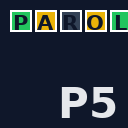
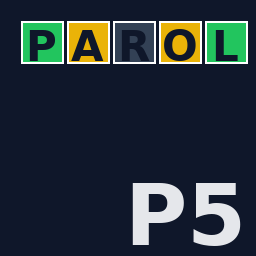
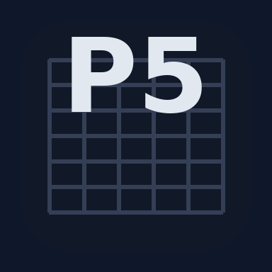

# 🎮 PAROLE5 — Wordle Italiano

---

## Perché un gioco funziona?
Non per la tecnologia.  
Non per l’algoritmo.  
Ma perché ti cattura. Ti fa tornare. Ti fa sfidare te stesso.  

**Parole5** è il Wordle in italiano, libero, open-source.  
Ogni giorno una parola diversa, 6 tentativi per indovinarla.  
E la soddisfazione di vedere quel riquadro 🟩 che dice: *hai colpito nel segno*.

---

## 🔗 Gioca Subito
👉 [**Vai alla PWA e gioca online**](https://www.alessandropezzali.it/parole5-pwa/)  
*(Installa come App su iPhone, Android, Windows, macOS: funziona offline)*

---

## 📥 Installa l’app
- Apri il link da browser (Safari, Chrome, Edge, Firefox).  
- Clicca su **Aggiungi a Home**.  
- Troverai l’icona **PAROLE5** accanto alle tue app preferite.  

---

## 🤝 Fork & Contribuisci
La pubblicità è un costo.  
La collaborazione è un investimento.  

Vuoi aggiungere parole, regole, stili?  
👉 [**Forka su GitHub**](https://github.com/pezzaliapp/parole5-pwa.git) e lascia la tua firma.  

---

## ✨ Funzionalità
- Dizionario italiano integrato (2.700+ parole a 5 lettere).  
- Modalità **Classica** e **Permissiva**.  
- Modalità **Difficile** (riutilizza verdi e gialle).  
- Bottone **Rivela parola del giorno** (per i più impazienti).  
- Condivisione risultato con 🟩🟨⬛.  
- PWA: funziona anche offline.  

---

## 📸 Ecco come appare

---

## 📜 Licenza

Questo progetto è distribuito con licenza **MIT**.

MIT License

Copyright (c) 2025 PezzaliAPP

Permission is hereby granted, free of charge, to any person obtaining a copy
of this software and associated documentation files (the “Software”), to deal
in the Software without restriction, including without limitation the rights
to use, copy, modify, merge, publish, distribute, sublicense, and/or sell
copies of the Software, and to permit persons to whom the Software is
furnished to do so, subject to the following conditions:

The above copyright notice and this permission notice shall be included in all
copies or substantial portions of the Software.

THE SOFTWARE IS PROVIDED “AS IS”, WITHOUT WARRANTY OF ANY KIND, EXPRESS OR
IMPLIED, INCLUDING BUT NOT LIMITED TO THE WARRANTIES OF MERCHANTABILITY,
FITNESS FOR A PARTICULAR PURPOSE AND NONINFRINGEMENT. IN NO EVENT SHALL THE
AUTHORS OR COPYRIGHT HOLDERS BE LIABLE FOR ANY CLAIM, DAMAGES OR OTHER
LIABILITY, WHETHER IN AN ACTION OF CONTRACT, TORT OR OTHERWISE, ARISING FROM,
OUT OF OR IN CONNECTION WITH THE SOFTWARE OR THE USE OR OTHER DEALINGS IN THE
SOFTWARE.

---

## 🌱 Filosofia PezzaliAPP

PezzaliAPP non è un’azienda.  
Non è una piattaforma chiusa.  
È un laboratorio aperto, nato nelle ore libere, per trasformare idee in strumenti utili.  

- **Open Source** → condividere ciò che si impara.  
- **Zero costi nascosti** → nessun server, nessuna pubblicità, nessuna dipendenza inutile.  
- **Etica della fiducia** → chi scarica e chi contribuisce non è un cliente, è parte del progetto.  
- **Cultura digitale** → non basta scrivere codice: serve costruire conoscenza, che resti accessibile e riutilizzabile.  

> *Ogni strumento è un gesto di fiducia.*  
